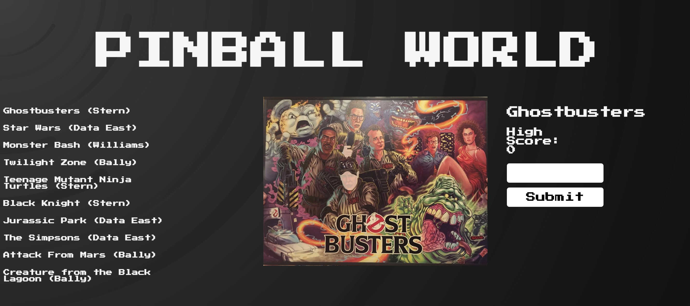

# PINBALL WORLD!!!

## Setup
json-server --watch db.json

## Challenge #1
Make a request to the server and put the list of games on the left side in the `#game-list` nav element.

## Challenge #2
When the page loads, show all the details of the the **first** game in the array returned from your fetch

## Challenge #3
The user should be able to click on the list of games in the nav to see its details.

## Challenge #4 
The user should be able to enter a high score in the form on the right side and have it show that value for "high score".

*The value of the high score does not need to persist between refreshes, but should save state when switching between games*

